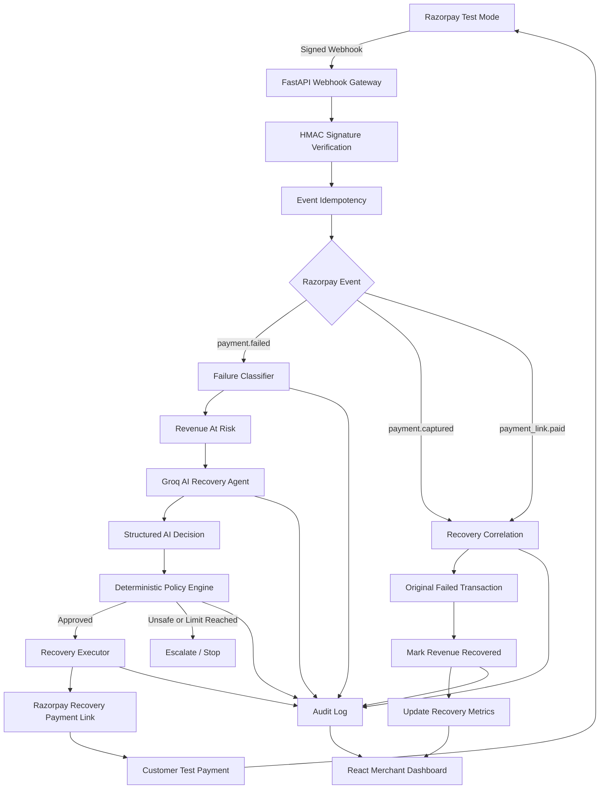
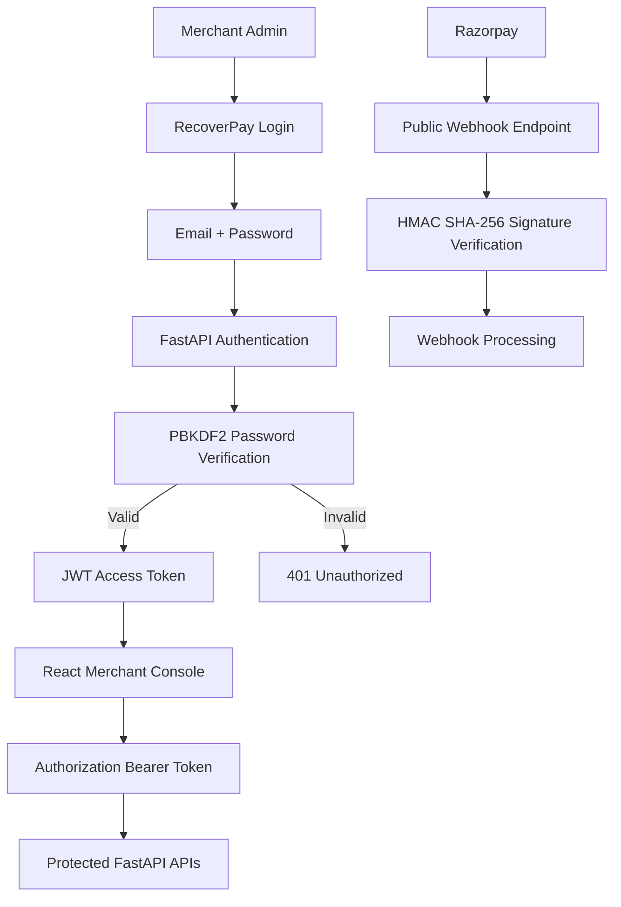
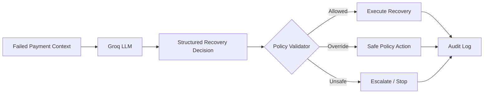

# RecoverPay AI

> **AI-Powered Revenue Recovery for Failed Digital Payments**

RecoverPay AI is an agentic revenue recovery platform built for the **Razorpay Buildathon — Track 3: AI Revenue Recovery**.

Instead of only reporting payment failures, RecoverPay AI detects revenue at risk, diagnoses the failure, selects a bounded recovery intervention using AI, executes the recovery through Razorpay Test Mode, and measures the amount successfully recovered.

---

## Problem Statement

Failed digital payments directly translate into lost revenue.

Traditional payment-monitoring systems often:

- record failed transactions,
- display failures on dashboards,
- retry every failure using similar logic,
- provide limited reasoning about the root cause,
- and stop without verifying whether the lost revenue was actually recovered.

A network failure, insufficient funds, authentication failure, bank outage, or card decline should not necessarily receive the same recovery treatment.

RecoverPay AI converts payment failures into **controlled, measurable, and auditable recovery workflows**.

---

# Solution

RecoverPay AI follows this recovery lifecycle:

```text
Detect
  ↓
Diagnose
  ↓
Decide
  ↓
Validate
  ↓
Act
  ↓
Measure
```

For every failed payment, RecoverPay AI can:

1. Detect the failed payment.
2. Calculate the revenue at risk.
3. Classify the failure reason.
4. Send the transaction context to Groq.
5. Generate a structured AI recovery recommendation.
6. Validate the recommendation using deterministic policy rules.
7. Execute an approved recovery intervention.
8. Generate a Razorpay recovery payment link when applicable.
9. Receive Razorpay success webhooks.
10. Correlate the recovery payment with the original failed payment.
11. Mark revenue as recovered.
12. Record every important action in an audit trail.

---

# Merchant Admin Console

RecoverPay includes a lightweight authenticated **Merchant Admin Console**.

The merchant dashboard is not publicly accessible.

```text
Merchant Admin
      ↓
Email + Password
      ↓
FastAPI Authentication
      ↓
JWT Access Token
      ↓
Protected RecoverPay APIs
      ↓
Dashboard
Transactions
Recovery Agent
Audit Trail
```

Merchant authentication protects access to:

- Revenue recovery metrics
- Razorpay recovery metrics
- Transaction details
- AI recovery decisions
- Recovery actions
- Batch recovery operations
- Demo operations
- Audit logs

The Razorpay webhook does **not** require the merchant JWT because Razorpay calls that endpoint directly.

Webhook security is handled independently using Razorpay HMAC signature verification.

---

# Authentication Security

RecoverPay uses:

- Merchant Admin authentication
- PBKDF2-HMAC-SHA256 password hashing
- Random password salt
- Time-limited JWT access tokens
- Session-scoped frontend authentication
- Protected FastAPI endpoints
- Razorpay HMAC-SHA256 webhook verification
- Constant-time signature comparisons
- Razorpay event idempotency

The merchant's actual password is never stored directly in `.env`.

Instead, a salted PBKDF2 password hash is stored.

---

# Live Razorpay Test Mode Results

RecoverPay AI has been tested end-to-end using **Razorpay Test Mode payment events**.

| Metric | Result |
|---|---:|
| Failed Test Payments | 2 |
| Active Risk | 0 |
| Recovered Test Payments | 2 |
| Test Revenue Recovered | ₹20 |
| Money Recovery Rate | 100% |

> These values represent Razorpay **Test Mode** transactions and do not represent production merchant revenue.

Tested recovery flow:

```text
Razorpay Test Payment
        ↓
Payment Failure
        ↓
payment.failed
        ↓
RecoverPay AI
        ↓
Root Cause Identification
        ↓
Groq AI Decision
        ↓
Policy Validation
        ↓
Razorpay Recovery Link
        ↓
Successful Test Payment
        ↓
payment.captured / payment_link.paid
        ↓
Original Payment Marked Recovered
```

---

# Razorpay Recovery Journey

The RecoverPay dashboard displays each failed Razorpay payment as an end-to-end journey.

```text
FAILED
   ↓
AI DECISION
   ↓
RECOVERED
```

Example:

```text
₹10 Netbanking Payment

FAILED
Card Declined
       ↓
AI DECISION
Recommend Alternate Method
       ↓
RECOVERED
₹10 recovered
```

Each transaction also provides a **View Recovery Journey** option containing the complete audit trail.

---

# Simulated Benchmark

RecoverPay also provides a deterministic 100-payment benchmark to evaluate the recovery engine at batch scale.

| Metric | Result |
|---|---:|
| Total Simulated Payments | 100 |
| Failed Payments | 37 |
| Revenue at Risk | ₹1,99,389 |
| Recovered Transactions | 27 |
| Revenue Recovered | ₹1,53,849 |
| Money Recovery Rate | 77.16% |
| Escalated Transactions | 10 |
| Outstanding Risk | ₹45,540 |

> These values are generated by the project's deterministic simulator and do not represent real merchant revenue.

The dashboard deliberately separates:

```text
RAZORPAY TEST MODE
Real integration proof
```

from:

```text
SIMULATED BENCHMARK
Batch-scale recovery evaluation
```

---

# Recovery Actions

The AI can recommend only actions from an explicitly bounded action space.

```text
SMART_RETRY
SEND_PAYMENT_LINK
SEND_REMINDER
RECOMMEND_ALTERNATE_METHOD
ESCALATE_TO_HUMAN
STOP_RECOVERY
```

The LLM recommendation is **not executed blindly**.

RecoverPay's deterministic policy engine validates the requested action before execution.

---

# Guardrails

RecoverPay implements bounded recovery instead of unrestricted autonomous execution.

Key safeguards include:

- Maximum retry limits
- Transaction-state validation
- Deterministic policy validation
- Human escalation
- Stopping rules
- Successful-state protection
- Webhook idempotency
- Duplicate-event protection
- Late failure protection
- Complete audit logging

A recovery workflow stops when:

```text
Payment Recovered
        OR
Maximum Attempts Reached
        OR
Human Escalation Required
        OR
Policy Prevents Further Recovery
```

---

# System Architecture



---

# Authentication Architecture



The two security paths are intentionally separated:

```text
Merchant
→ JWT Authentication
→ Protected Dashboard APIs
```

and:

```text
Razorpay
→ Signed Webhook
→ HMAC Verification
→ Webhook Processing
```

---

# AI Agent Architecture

RecoverPay separates probabilistic AI reasoning from deterministic execution.



This prevents the LLM from having unrestricted control over payment execution.

---

# Audit Trail

A successful Razorpay Test Mode recovery can produce an audit sequence such as:

```text
RAZORPAY_WEBHOOK_RECEIVED
        ↓
PAYMENT_FAILED
        ↓
ROOT_CAUSE_IDENTIFIED
        ↓
REVENUE_AT_RISK
        ↓
AI_DECISION_GENERATED
        ↓
POLICY_VALIDATED
        ↓
RAZORPAY_RECOVERY_LINK_CREATED
        ↓
RAZORPAY_RECOVERY_PAYMENT_RECEIVED
        ↓
RECOVERY_SUCCESS
        ↓
RAZORPAY_PAYMENT_LINK_PAID
```

The audit trail can be inspected directly from the RecoverPay Merchant Console.

---

# Dashboard

RecoverPay provides four major merchant views.

### Dashboard

Shows:

- Razorpay Test Mode recovery metrics
- Live Razorpay recovery journeys
- Simulated benchmark metrics
- Revenue at risk
- Revenue recovered
- Recovery rate
- Outstanding risk
- Failure distribution
- Recovery strategy distribution

### Transactions

Allows merchants to inspect individual transactions and their current recovery status.

### Recovery Agent

Displays the AI-driven revenue recovery workflow.

### Audit Trail

Provides visibility into recovery decisions and execution events.

---

# Key Features

### Payment Failure Detection

Consumes Razorpay:

```text
payment.failed
```

events and creates revenue-at-risk records.

---

### Root Cause Classification

Failure reasons may include:

```text
insufficient_funds
authentication_failed
card_declined
bank_declined
payment_declined
network_error
bank_unavailable
unknown_failure
```

---

### AI Recovery Decisions

Groq receives contextual transaction data including:

```text
Transaction amount
Payment method
Failure reason
Retry count
Maximum retry limit
```

and produces a structured decision similar to:

```json
{
  "diagnosis": "Payment method was declined",
  "action": "RECOMMEND_ALTERNATE_METHOD",
  "reason": "Suggest a different payment method",
  "confidence": 0.85,
  "risk_level": "medium",
  "retry_delay_minutes": 0,
  "should_escalate": false,
  "decision_source": "groq"
}
```

---

### Safe AI Fallback

If the AI provider becomes unavailable or returns an invalid structured response, RecoverPay uses a deterministic fallback recovery decision.

---

### Razorpay Recovery Links

Eligible failed Razorpay transactions can receive a new Razorpay Test Mode Payment Link.

---

### Recovery Correlation

Successful recovery payments are correlated with the original failed transaction.

Transaction lifecycle:

```text
at_risk
    ↓
recovery_pending
    ↓
recovered
```

---

### Revenue Measurement

RecoverPay measures:

```text
revenue_at_risk
revenue_recovered
outstanding_risk
transaction_recovery_rate
money_recovery_rate
```

---

### Live Recovery Polling

While a Razorpay transaction is in:

```text
recovery_pending
```

the frontend automatically checks for updated recovery status.

Once Razorpay confirms successful payment, the UI updates the transaction and revenue metrics.

---

# Technology Stack

## Frontend

- React
- Vite
- Axios
- Recharts
- Lucide React

## Backend

- Python
- FastAPI
- SQLAlchemy
- SQLite
- Pydantic
- Uvicorn

## Authentication

- PyJWT
- JWT Bearer Authentication
- PBKDF2-HMAC-SHA256
- Session Storage

## AI

- Groq API
- Structured LLM responses
- Deterministic fallback recovery engine

## Payments

- Razorpay Test Mode
- Razorpay Payment Links
- Razorpay Webhooks

## Security

- JWT merchant authentication
- PBKDF2-HMAC-SHA256 password hashing
- HMAC-SHA256 Razorpay webhook verification
- Constant-time signature comparison
- Event ID idempotency
- Environment-variable secret management
- Policy-controlled AI execution

---

# Project Structure

```text
RecoverPay-AI/
│
├── backend/
│   └── app/
│       ├── __init__.py
│       ├── ai_agent.py
│       ├── auth.py
│       ├── database.py
│       ├── main.py
│       ├── models.py
│       ├── razorpay_service.py
│       ├── razorpay_webhook.py
│       ├── recovery_engine.py
│       ├── recovery_service.py
│       ├── schemas.py
│       └── simulator.py
│
├── frontend/
│   ├── src/
│   │   ├── pages/
│   │   │   ├── AuditTrailPage.jsx
│   │   │   ├── RecoveryAgentPage.jsx
│   │   │   └── TransactionsPage.jsx
│   │   │
│   │   ├── api.js
│   │   ├── auth.js
│   │   ├── AuthGate.jsx
│   │   ├── AuthGate.css
│   │   ├── App.jsx
│   │   ├── App.css
│   │   └── main.jsx
│   │
│   └── package.json
│
├── .env.example
├── .gitignore
├── requirements.txt
└── README.md
```

Local files such as:

```text
.env
recoverpay.db
venv/
node_modules/
```

are excluded from Git.

---

# Installation

## 1. Clone Repository

```powershell
git clone https://github.com/Rahul-pr-0503/RecoverPay-AI.git
cd RecoverPay-AI
```

---

## 2. Create Python Virtual Environment

Windows PowerShell:

```powershell
python -m venv venv
```

Activate:

```powershell
.\venv\Scripts\Activate.ps1
```

---

## 3. Install Backend Dependencies

```powershell
pip install -r requirements.txt
```

Important backend packages include:

```text
FastAPI
SQLAlchemy
Groq
Razorpay
PyJWT
python-dotenv
```

---

# Environment Configuration

Create a file named:

```text
.env
```

in the root directory:

```text
RecoverPay-AI/
├── backend/
├── frontend/
├── .env
├── .env.example
├── requirements.txt
└── README.md
```

Your `.env` will eventually contain:

```env
GROQ_API_KEY=your_real_groq_key

RAZORPAY_KEY_ID=your_real_test_key_id
RAZORPAY_KEY_SECRET=your_real_test_key_secret
RAZORPAY_WEBHOOK_SECRET=your_real_webhook_secret

MERCHANT_ADMIN_EMAIL=admin@recoverpay.ai
MERCHANT_ADMIN_PASSWORD_HASH=your_generated_hash
JWT_SECRET=your_generated_jwt_secret
```

Never commit `.env`.

---

# Creating Merchant Admin Credentials

RecoverPay does **not** store the Merchant Admin password as plaintext.

You create a salted PBKDF2 password hash and store only the hash.

## Step 1 — Choose Merchant Admin Email

For example:

```env
MERCHANT_ADMIN_EMAIL=admin@recoverpay.ai
```

You can replace this with another merchant/admin email.

---

## Step 2 — Generate Merchant Password Hash

From the project root, run this Windows PowerShell-safe command:

```powershell
python -c "import hashlib,secrets,getpass; p=getpass.getpass('Merchant admin password: '); s=secrets.token_bytes(16); i=260000; h=hashlib.pbkdf2_hmac('sha256',p.encode(),s,i); d=chr(36); print(str(i)+d+s.hex()+d+h.hex())"
```

You will see:

```text
Merchant admin password:
```

Type the password you want to use.

The password will **not appear on the terminal while typing**. This is expected.

Press Enter.

The command prints a value similar to:

```text
260000$7a219d...$ba45e8...
```

Copy the **entire generated line**.

Do not share this value publicly.

Add it to `.env`:

```env
MERCHANT_ADMIN_PASSWORD_HASH=260000$YOUR_SALT$YOUR_HASH
```

Do not add:

```env
MERCHANT_ADMIN_PASSWORD=my_password
```

The plaintext password should never be stored in `.env`.

---

## Step 3 — Generate JWT Secret

Run:

```powershell
python -c "import secrets; print(secrets.token_urlsafe(48))"
```

Example output:

```text
L1-example-random-secret-value-generated-by-python
```

Copy the generated value.

Add it to `.env`:

```env
JWT_SECRET=PASTE_GENERATED_VALUE_HERE
```

Never commit this secret to GitHub.

---

## Step 4 — Final Merchant Authentication Configuration

Your `.env` authentication section should now look like:

```env
MERCHANT_ADMIN_EMAIL=admin@recoverpay.ai
MERCHANT_ADMIN_PASSWORD_HASH=260000$YOUR_GENERATED_SALT$YOUR_GENERATED_HASH
JWT_SECRET=YOUR_GENERATED_RANDOM_JWT_SECRET
```

---

## Step 5 — `.env.example`

For GitHub, use placeholders only:

```env
GROQ_API_KEY=your_groq_api_key

RAZORPAY_KEY_ID=your_razorpay_test_key_id
RAZORPAY_KEY_SECRET=your_razorpay_test_key_secret
RAZORPAY_WEBHOOK_SECRET=your_webhook_secret

MERCHANT_ADMIN_EMAIL=admin@recoverpay.ai
MERCHANT_ADMIN_PASSWORD_HASH=your_generated_pbkdf2_hash
JWT_SECRET=your_generated_jwt_secret
```

`.env.example` can safely be committed.

`.env` must remain ignored.

---

# Merchant Login

Once the backend and frontend are running, open:

```text
http://localhost:5173
```

You should see:

```text
RecoverPay
AI Revenue Recovery

MERCHANT CONSOLE

Welcome back

Merchant Admin Email
[                       ]

Password
[                       ]

[ Sign In to RecoverPay ]
```

Use:

```text
Email:
The value configured in MERCHANT_ADMIN_EMAIL

Password:
The plaintext password you originally entered when generating
MERCHANT_ADMIN_PASSWORD_HASH
```

The plaintext password is only used during login.

FastAPI hashes the submitted password again using the stored salt and compares the result securely.

---

# Merchant Session

After successful login:

```text
Credentials
     ↓
POST /auth/login
     ↓
Password Verification
     ↓
JWT Generated
     ↓
Stored in sessionStorage
     ↓
Authorization: Bearer <token>
     ↓
Protected RecoverPay API
```

The JWT session currently expires after a limited period.

Closing the browser tab removes the frontend `sessionStorage` authentication session.

---

# Authentication API

## Login

```http
POST /auth/login
```

Example request:

```json
{
  "email": "admin@recoverpay.ai",
  "password": "your_password"
}
```

Successful response:

```json
{
  "access_token": "...",
  "token_type": "bearer",
  "expires_in": 28800,
  "admin": {
    "email": "admin@recoverpay.ai",
    "role": "merchant_admin"
  }
}
```

---

## Current Merchant

```http
GET /auth/me
```

Requires:

```http
Authorization: Bearer <JWT>
```

---

# Testing Authentication

## Public Health Endpoint

Open:

```text
http://127.0.0.1:8000/health
```

It should work without Merchant authentication.

---

## Protected Endpoint

While logged out, open:

```text
http://127.0.0.1:8000/metrics
```

Expected response:

```json
{
  "detail": "Merchant authentication required."
}
```

with:

```text
401 Unauthorized
```

---

## Login Test

Open:

```text
http://localhost:5173
```

Enter the Merchant Admin email and password.

Successful login should open the RecoverPay dashboard.

---

## Logout Test

Click the logout icon in the Merchant Admin sidebar card.

You should immediately return to the login screen.

---

# Start Backend

From the project root:

```powershell
uvicorn backend.app.main:app --reload
```

Backend:

```text
http://127.0.0.1:8000
```

Swagger:

```text
http://127.0.0.1:8000/docs
```

---

# Start Frontend

Open another PowerShell terminal:

```powershell
cd frontend
npm install
npm run dev
```

Frontend:

```text
http://localhost:5173
```

---

# Razorpay Configuration

Use Razorpay **Test Mode** credentials.

Add:

```env
RAZORPAY_KEY_ID=your_razorpay_test_key_id
RAZORPAY_KEY_SECRET=your_razorpay_test_key_secret
```

---

# Razorpay Webhook Configuration

The webhook endpoint is:

```text
POST /razorpay/webhook
```

For local development, expose FastAPI through a secure public tunnel.

Configure these Razorpay Test Mode webhook events:

```text
payment.failed
payment.captured
payment_link.paid
```

Create a webhook secret in Razorpay and store the same value locally:

```env
RAZORPAY_WEBHOOK_SECRET=your_webhook_secret
```

The webhook secret is different from:

```env
RAZORPAY_KEY_SECRET
```

---

# Webhook Security

RecoverPay verifies webhook authenticity before trusting the JSON payload.

```text
Webhook Request
      ↓
Read Raw Body
      ↓
Read X-Razorpay-Signature
      ↓
Generate HMAC SHA-256
      ↓
Constant-Time Signature Comparison
      ↓
Event Idempotency Check
      ↓
Parse Event
      ↓
Process Payment Event
```

The webhook endpoint intentionally does not require Merchant JWT authentication.

Razorpay authenticates through the webhook signature instead.

---

# Important API Endpoints

## Public

```http
GET /
GET /health
POST /auth/login
POST /razorpay/webhook
```

---

## Merchant Protected

```http
GET /auth/me

GET /metrics
GET /metrics/razorpay

GET /transactions
GET /transactions/{transaction_id}

GET /transactions/{transaction_id}/ai-decision
GET /transactions/{transaction_id}/audit

GET /audit

POST /transactions/{transaction_id}/recover

POST /transactions/{transaction_id}/razorpay-recovery-link

POST /recover-all

POST /simulate

POST /demo/reset
POST /demo/new-batch
```

Protected routes require:

```http
Authorization: Bearer <JWT>
```

---

# Git Security

The repository `.gitignore` excludes secrets and runtime files.

Important ignored files include:

```text
.env
recoverpay.db
*.db
venv/
node_modules/
__pycache__/
*.pyc
```

Safe configuration documentation is provided through:

```text
.env.example
```

Before committing, you can verify:

```powershell
git status
```

Make sure `.env` is not staged.

---

# Running RecoverPay

Start backend:

```powershell
uvicorn backend.app.main:app --reload
```

Start frontend:

```powershell
cd frontend
npm run dev
```

Open:

```text
http://localhost:5173
```

Sign in using your Merchant Admin credentials.

---

# Why RecoverPay AI?

Many systems stop at:

```text
Payment Failed
```

RecoverPay continues:

```text
Payment Failed
        ↓
Why did it fail?
        ↓
What intervention is appropriate?
        ↓
Is that intervention allowed?
        ↓
Execute Recovery
        ↓
Did the customer pay?
        ↓
How much revenue returned?
```

---

# Key Differentiator

RecoverPay AI is not simply a payment failure classifier or analytics dashboard.

It closes the full revenue-recovery loop:

```text
Detection
+
Root Cause Diagnosis
+
AI Decision
+
Deterministic Guardrails
+
Razorpay Execution
+
Webhook Verification
+
Revenue Measurement
+
Auditability
```

---

# Buildathon Track

**Razorpay Buildathon**

**Track 3 — AI Revenue Recovery**

RecoverPay demonstrates:

- Revenue-at-risk detection
- Failure diagnosis
- AI-selected interventions
- Deterministic policy validation
- Bounded recovery execution
- Retry limits
- Stopping rules
- Human escalation
- Razorpay-native recovery execution
- Measured money recovery
- Complete audit history
- Authenticated Merchant Admin Console

---

# Future Scope

Potential production enhancements include:

- Multi-merchant authentication
- Role-based access control
- Finance and Support roles
- PostgreSQL
- Redis / Celery background workers
- SMS recovery notifications
- WhatsApp recovery campaigns
- Email recovery campaigns
- Subscription mandate recovery
- Promise-to-pay workflows
- Customer recovery scoring
- Merchant-specific recovery policies
- Experimentation across recovery strategies
- Production Razorpay deployment
- Recovery attribution analytics

---

# Disclaimer

RecoverPay AI currently uses **Razorpay Test Mode** for payment integration.

The ₹20 recovery result shown in the live Razorpay dashboard represents Test Mode transactions.

The ₹1,53,849 recovery result comes from the project's deterministic 100-payment simulated benchmark.

Neither value represents production merchant revenue.

---

# Repository

```text
https://github.com/Rahul-pr-0503/RecoverPay-AI
```

---

# RecoverPay AI

> **Turn payment failures into measurable recovery workflows.**