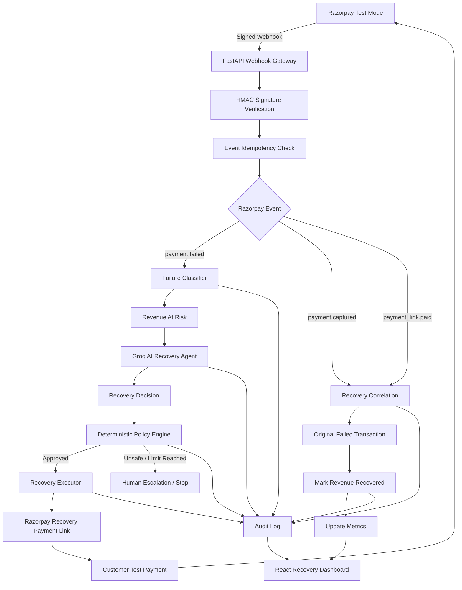
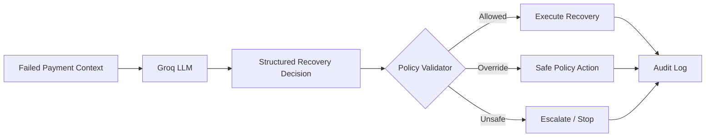

# RecoverPay AI

> **AI-Powered Revenue Recovery for Failed Digital Payments**

RecoverPay AI is an agentic revenue recovery platform built for the **Razorpay Buildathon — Track 3: AI Revenue Recovery**.

Instead of only reporting payment failures, RecoverPay AI detects revenue at risk, diagnoses the failure, selects a bounded recovery intervention using AI, executes the recovery through Razorpay Test Mode, and measures the amount successfully recovered.

---

## Problem

Failed digital payments directly translate into lost revenue.

Traditional systems often:

- log payment failures,
- show them on dashboards,
- apply the same retry logic to every failure,
- provide limited reasoning about why a payment failed,
- and do not automatically close the recovery loop.

A network timeout, insufficient funds, authentication failure, bank outage, and issuer decline should not necessarily receive the same recovery action.

RecoverPay AI turns these failures into controlled and measurable recovery workflows.

---

## Solution

RecoverPay AI follows a guarded agentic workflow:

```text
Detect
  ↓
Diagnose
  ↓
Decide
  ↓
Validate
  ↓
Act
  ↓
Measure
```

For every failed payment, RecoverPay AI:

1. Detects the failed transaction.
2. Calculates the revenue at risk.
3. Classifies the payment failure.
4. Sends contextual information to Groq.
5. Generates an AI recovery recommendation.
6. Validates the recommendation using deterministic policy rules.
7. Executes an approved recovery intervention.
8. Receives the resulting Razorpay webhook.
9. Marks the original transaction as recovered when payment succeeds.
10. Records the full journey in an audit trail.

---

# Live Razorpay Test Mode Results

RecoverPay AI has been tested end-to-end using actual **Razorpay Test Mode payment events**.

| Metric | Result |
|---|---:|
| Failed Test Payments | 2 |
| Recovered Test Payments | 2 |
| Active Risk | 0 |
| Test Revenue Recovered | ₹20 |
| Money Recovery Rate | 100% |

> These values are **Razorpay Test Mode results** and do not represent production merchant revenue.

The tested flow was:

```text
Razorpay Test Payment
        ↓
Payment Failure
        ↓
payment.failed Webhook
        ↓
RecoverPay
        ↓
Groq AI Decision
        ↓
Policy Validation
        ↓
Razorpay Recovery Link
        ↓
Successful Test Payment
        ↓
payment.captured / payment_link.paid
        ↓
Original Revenue Risk Closed
```

---

# Simulated Benchmark

In addition to live Razorpay Test Mode integration, RecoverPay AI includes a deterministic 100-payment benchmark for evaluating recovery behavior at batch scale.

| Metric | Result |
|---|---:|
| Total Simulated Payments | 100 |
| Failed Payments | 37 |
| Revenue at Risk | ₹1,99,389 |
| Recovered Transactions | 27 |
| Revenue Recovered | ₹1,53,849 |
| Money Recovery Rate | 77.16% |
| Escalated Transactions | 10 |
| Outstanding Risk | ₹45,540 |

> These are **simulated benchmark results**, not real merchant transactions or production revenue.

The live Razorpay metrics and simulated benchmark are deliberately separated in the dashboard.

---

# Recovery Actions

The AI can recommend only actions from an explicitly bounded action space:

```text
SMART_RETRY
SEND_PAYMENT_LINK
SEND_REMINDER
RECOMMEND_ALTERNATE_METHOD
ESCALATE_TO_HUMAN
STOP_RECOVERY
```

The AI recommendation is not executed blindly.

RecoverPay's deterministic policy layer validates whether the proposed action is allowed for the transaction state and failure type.

---

# Guardrails

RecoverPay AI implements bounded recovery rather than unlimited autonomous retries.

Key safeguards include:

- Maximum retry limits
- Transaction-state validation
- Policy validation before execution
- Human escalation
- Stopping rules
- Successful-state protection
- Webhook idempotency
- Late failure protection
- Complete audit logging

A workflow stops when:

```text
Payment Recovered
        OR
Maximum Attempts Reached
        OR
Human Escalation Required
        OR
Recovery Policy Stops Further Action
```

---

# Architecture



---

# Agent Architecture

RecoverPay separates probabilistic AI reasoning from deterministic execution.



This architecture ensures that the LLM can recommend actions without having unrestricted control over payment execution.

---

# End-to-End Recovery Journey

A real Razorpay Test Mode recovery produced the following audit sequence:

```text
RAZORPAY_WEBHOOK_RECEIVED
        ↓
PAYMENT_FAILED
        ↓
ROOT_CAUSE_IDENTIFIED
        ↓
REVENUE_AT_RISK
        ↓
AI_DECISION_GENERATED
        ↓
POLICY_VALIDATED
        ↓
RAZORPAY_RECOVERY_LINK_CREATED
        ↓
RAZORPAY_RECOVERY_PAYMENT_RECEIVED
        ↓
RECOVERY_SUCCESS
        ↓
RAZORPAY_PAYMENT_LINK_PAID
```

The audit trail is visible directly from the RecoverPay frontend.

---

# Dashboard

The RecoverPay dashboard provides two intentionally separated views.

## Razorpay Test Mode — Live

Shows actual events received from Razorpay Test Mode:

- Failed payments
- Active risk
- Recovered payments
- Revenue recovered
- Recovery rate
- Individual recovery journeys

Each live Razorpay transaction displays:

```text
FAILED
   →
AI DECISION
   →
RECOVERED
```

Users can open the full Recovery Journey and inspect its audit history.

## Simulated Benchmark

Shows large-batch evaluation metrics:

- Revenue at risk
- Revenue recovered
- Money recovery rate
- Outstanding risk
- Payment failure distribution
- Recovery strategy distribution

---

# Features

### Payment Failure Detection

Consumes Razorpay `payment.failed` webhooks and creates at-risk transactions.

### Root-Cause Classification

Maps payment errors into categories such as:

```text
insufficient_funds
authentication_failed
card_declined
bank_declined
payment_declined
network_error
bank_unavailable
unknown_failure
```

### AI Recovery Decisions

Groq receives:

- transaction amount,
- payment method,
- failure reason,
- retry count,
- maximum retries.

It returns a structured decision containing:

```json
{
  "diagnosis": "...",
  "action": "RECOMMEND_ALTERNATE_METHOD",
  "reason": "...",
  "confidence": 0.85,
  "risk_level": "medium",
  "retry_delay_minutes": 0,
  "should_escalate": false,
  "decision_source": "groq"
}
```

### Safe AI Fallback

If the AI service becomes unavailable or produces an invalid response, RecoverPay switches to a deterministic fallback decision engine.

### Razorpay Recovery Links

For eligible Razorpay transactions, RecoverPay can create a new Razorpay Test Mode payment link programmatically.

### Recovery Correlation

Successful recovery payments are correlated back to the original failed transaction.

The original transaction changes from:

```text
at_risk
```

to:

```text
recovery_pending
```

and finally:

```text
recovered
```

### Revenue Measurement

RecoverPay records:

```text
revenue_at_risk
revenue_recovered
outstanding_risk
money_recovery_rate
```

### Live Recovery Polling

The frontend monitors `recovery_pending` transactions and automatically refreshes when Razorpay confirms successful recovery.

### Audit Trail

Every important step is persisted and visible from the UI.

---

# Technology Stack

## Frontend

- React
- Vite
- Axios
- Recharts
- Lucide React

## Backend

- Python
- FastAPI
- SQLAlchemy
- SQLite
- Pydantic
- Uvicorn

## AI

- Groq API
- Structured LLM responses
- Deterministic fallback engine

## Payments

- Razorpay Test Mode
- Razorpay Payment Links API
- Razorpay Webhooks

## Security

- HMAC-SHA256 webhook verification
- Constant-time signature comparison
- Event ID idempotency
- Environment-variable secrets
- Policy-controlled AI actions

---

# Project Structure

```text
RecoverPay-AI/
│
├── backend/
│   └── app/
│       ├── __init__.py
│       ├── ai_agent.py
│       ├── database.py
│       ├── main.py
│       ├── models.py
│       ├── razorpay_service.py
│       ├── razorpay_webhook.py
│       ├── recovery_engine.py
│       ├── recovery_service.py
│       ├── schemas.py
│       └── simulator.py
│
├── frontend/
│   ├── src/
│   │   ├── pages/
│   │   │   ├── AuditTrailPage.jsx
│   │   │   ├── RecoveryAgentPage.jsx
│   │   │   └── TransactionsPage.jsx
│   │   │
│   │   ├── api.js
│   │   ├── App.jsx
│   │   ├── App.css
│   │   └── main.jsx
│   │
│   └── package.json
│
├── .env
├── .gitignore
├── recoverpay.db
├── requirements.txt
└── README.md
```

---

# Local Setup

## 1. Clone the repository

```bash
git clone <https://github.com/Rahul-pr-0503/RecoverPay-AI>
cd RecoverPay-AI
```

---

## 2. Create Python virtual environment

### Windows

```powershell
python -m venv venv
.\venv\Scripts\Activate.ps1
```

---

## 3. Install backend dependencies

```bash
pip install -r requirements.txt
```

---

## 4. Configure environment variables

Create:

```text
.env
```

in the project root.

Example:

```env
GROQ_API_KEY=your_groq_api_key

RAZORPAY_KEY_ID=your_razorpay_test_key_id
RAZORPAY_KEY_SECRET=your_razorpay_test_key_secret

RAZORPAY_WEBHOOK_SECRET=your_webhook_secret
```

Never commit `.env`.

---

## 5. Start backend

From the project root:

```bash
uvicorn backend.app.main:app --reload
```

Backend:

```text
http://127.0.0.1:8000
```

Swagger:

```text
http://127.0.0.1:8000/docs
```

---

## 6. Start frontend

```bash
cd frontend
npm install
npm run dev
```

Frontend:

```text
http://localhost:5173
```

---

# Razorpay Webhook Setup

For local development, expose FastAPI through a secure public tunnel.

The webhook endpoint is:

```text
POST /razorpay/webhook
```

Configure Razorpay Test Mode webhook events:

```text
payment.failed
payment.captured
payment_link.paid
```

Use the same value for the Razorpay dashboard webhook secret and:

```env
RAZORPAY_WEBHOOK_SECRET=
```

Do not use the Razorpay API Key Secret as the webhook secret.

---

# Important API Endpoints

## Health

```http
GET /health
```

## Simulation

```http
POST /simulate
```

## Fresh Benchmark Batch

```http
POST /demo/new-batch
```

## Transactions

```http
GET /transactions
GET /transactions/{transaction_id}
```

## AI Decision

```http
GET /transactions/{transaction_id}/ai-decision
```

## Transaction Audit

```http
GET /transactions/{transaction_id}/audit
```

## Global Audit

```http
GET /audit
```

## Simulated Metrics

```http
GET /metrics
```

## Razorpay Test Mode Metrics

```http
GET /metrics/razorpay
```

## Recover Transaction

```http
POST /transactions/{transaction_id}/recover
```

## Batch Recovery

```http
POST /recover-all
```

## Create Razorpay Recovery Link

```http
POST /transactions/{transaction_id}/razorpay-recovery-link
```

## Razorpay Webhook

```http
POST /razorpay/webhook
```

---

# Webhook Security

RecoverPay does not trust incoming webhook JSON directly.

The processing order is:

```text
Receive raw request body
        ↓
Read X-Razorpay-Signature
        ↓
Generate HMAC SHA-256
        ↓
Constant-time signature comparison
        ↓
Check event idempotency
        ↓
Parse JSON
        ↓
Process event
```

Duplicate webhook events are ignored using Razorpay event IDs.

---

# Why RecoverPay AI?

Most payment monitoring systems stop at:

```text
Payment Failed
```

RecoverPay continues:

```text
Payment Failed
        ↓
Why?
        ↓
What is the safest next action?
        ↓
Execute
        ↓
Did revenue return?
        ↓
How much?
```

This converts payment analytics into measurable revenue recovery.

---

# Key Differentiator

RecoverPay AI is not only a payment-failure classifier.

It closes the entire revenue-recovery loop:

```text
Detection
+
AI Diagnosis
+
Bounded Decision Making
+
Payment Execution
+
Webhook Verification
+
Recovery Measurement
+
Auditability
```

---

# Buildathon Track

**Razorpay Buildathon**

**Track 3 — AI Revenue Recovery**

The project demonstrates:

- Revenue-risk detection
- Root-cause diagnosis
- AI-selected interventions
- Bounded execution
- Retry limits
- Stopping rules
- Human escalation
- Measured recovery
- Complete audit trail
- Razorpay Test Mode integration

---

# Disclaimer

RecoverPay AI currently uses Razorpay **Test Mode** for payment integrations.

The ₹20 live recovery result represents Test Mode transactions.

The larger ₹1,53,849 recovery figure is produced from the project's deterministic simulated benchmark.

Neither figure should be interpreted as production merchant revenue.

---

# Future Scope

Potential production extensions include:

- Merchant-specific recovery policies
- SMS / WhatsApp recovery outreach
- Email recovery campaigns
- Subscription mandate recovery
- Promise-to-pay workflows
- Customer recovery scoring
- Experimentation across recovery strategies
- Production-grade PostgreSQL
- Background queues using Celery / Redis
- Multi-merchant architecture
- Production Razorpay integration
- Recovery attribution analytics

---

# Team

Built for the **Razorpay Buildathon — Track 3: AI Revenue Recovery**.

---

## RecoverPay AI

**Turn payment failures into measurable recovery workflows.**